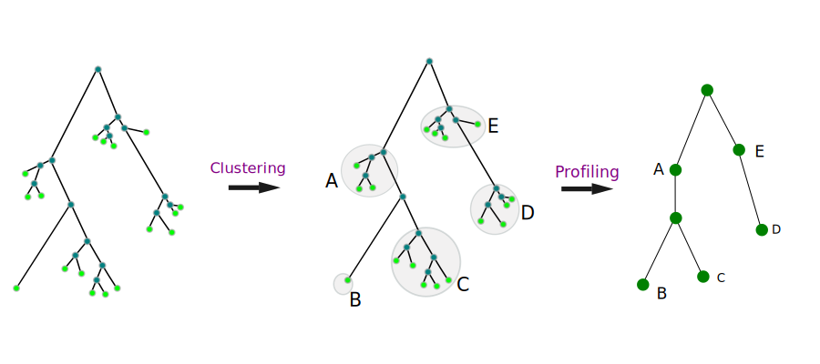
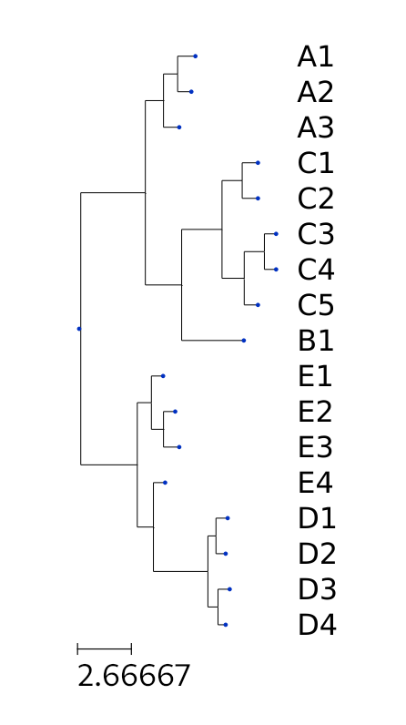

# Biotools
Biotools is an integrated toolset for bioinformatics.  

## table of contents  
* [Introduction](#Introduction)
* [Requirements](#Requirements)
* [Install](#Install)
* [Usage](#Usage)
* [Example](#Example)
## Introduction
Biotools is an integrated tool set for bioinformatics, it contain tools for formatting data, statistic bioinformatics data, handing phylogenetic tree et al. 

### 1. Phylogenic tree tools

* __Motivation__
  When we operat big phlogenic tree(for example a tree have thousands of leave node),
  analyse relationship of each node will be difficult if using GUI tools. And to drow this tree to a printable paper would be a problem too, may can print the tree using a A4 paper.
  So, I developed these tools to handle this problem.

1. phytree_setroot  
For a tree(stored by newick format), this tree may not set outgroup, and need to chose a node a outgruop node and root this tree. This tool is used doing this job, just give the tree file and name of outgroup node, the tool will output a tree file which have rooted.   

2. phytree_show 
This tool is used to show tree, and to have quick look of tree and save the figure in pdf format file.

3. phytree_statistic
Show tree information, for example leaf which have longest branch, and average branch length of leaf. those information is usful when clustering or collapse tree.

4. phytree_cluster   
A as in above figure, the tree node would be clustered into groups, and print the clusting result into file. Then those cluser can be used for downstream analysis.

5. phytree_collapse   
Same as phytree_cluster tool, and collapse node within a cluster into a new node(We called it a circle node), and generage a profile tree, which represent the circle node tree.
 

## Requirements
* python3 >= 3.7  
* [biobrary](https://github.com/benjaminfang/biobrary)    

## Install
1. Install requirements.  
    `pip installl biobrary --user`

2. Install biotools  
`git clone https://github.com/benjaminfang/biotools`  
`cd biobrary`  
`./biobrary -h`  

    ___optional___:
    you can link biobrary to you PATH environment, in oreder to run this command without path prefix.  

## Usage
`biotools -h`  
```
Tools for bioinformatics.
The flowing tools/subcommand was supported:

    * format_fasta_head
    * format_table_separater
    * extra_table_raws
    * statistic_assembly
    * statistic_phytree
    * find_updown_elements
    * phytree_statistic
    * phytree_cluster
    * phytree_collapse
    * phytree_show

usage: biotools [-h] [-V] cmd_name [cmd_args [cmd_args ...]]

positional arguments:
  cmd_name       subcommand name.
  cmd_args       subcommand arguments.

optional arguments:
  -h, --help     show this help message and exit
  -V, --version  show program's version number and exit

```
 ### 1. Phylogenic tree tools

#### phytree_show
`biotools phytree_show -h`
```
usage: phytree_show [-h] [-TM {c,r}] [-SBL] [-SLN] [-SBP] [-SIN] [-AL] [-HI]
                    [-SP]
                    nwkfile

show phylogeneitc tree.

positional arguments:
  nwkfile               tree file name in newik format.

optional arguments:
  -h, --help            show this help message and exit
  -TM {c,r}, --tree_mode {c,r}
                        tree style mode.
  -SBL, --show_branch_length
                        show branch length
  -SLN, --show_leaf_name
                        show leaf name.
  -SBP, --show_branch_support
                        show branch support.
  -SIN, --show_inner_name
                        show inner node name.
  -AL, --align_leaf_name
                        align leaf name
  -HI, --hide_inner_node
                        hide inner node point.
  -SP, --save_plot      save plot directly.

```


#### phytree_statistic  
`biobrary phytree_statistic -h`  
```
usage: phytree_statistic [-h] [-f_out F_OUT] tree_file

statistic phylogenetice tree.

positional arguments:
  tree_file     tree file name.

optional arguments:
  -h, --help    show this help message and exit
  -f_out F_OUT  out file name.

```

#### phytree_cluster  
`biotools phytree_cluster -h`
```
usage: phytree_groups [-h] [-f_cluster_res F_CLUSTER_RES]
                      [-f_profile_tree F_PROFILE_TREE]
                      treefile edge_len_cutoff

This is a utility to cluster a tree's node according to length of edge.

positional arguments:
  treefile              file name of newike tree.
  edge_len_cutoff       cutoff of edge length to make a circlal cluster.

optional arguments:
  -h, --help            show this help message and exit
  -f_cluster_res F_CLUSTER_RES
                        file name to output cluster result, default is
                        "cluster.fasta".
  -f_profile_tree F_PROFILE_TREE
                        CircleNode Tree profile tree file. default is
                        "profile.nwk".

```

#### phytree_collapse
`biotools phytree_collapse -h`
```
usage: phytree_collapse [-h] {cluster} ...

utilit to collapse phylogenetic tree.

positional arguments:
  {cluster}   methods to collapse phytree.
    cluster   user methods cluster to collapse phytree.

optional arguments:
  -h, --help  show this help message and exit
```


## Examples
#### 1. Phylogenic tree tools 
1. phytree_setroot
Using "Reference" as outgroup and rooted the tree, and save the result into tree_rooted.nwk. If no outgroup given, using tree midpoint as root.
`biotools phytree_setroot -o tree_rooted.nwk -OGN Reference test/unrooted_tree.nwk`  

2. phytree_show
Show tree by retangle shap and show leave name and aligned the names and hide inner node.
`biotools phytree_show -TM r -SLN -HI -AL test/test_tree.nwk`



To save the plot using -SP argument and a file named "plot.pdf" will gerated.

3. phytree_statistic